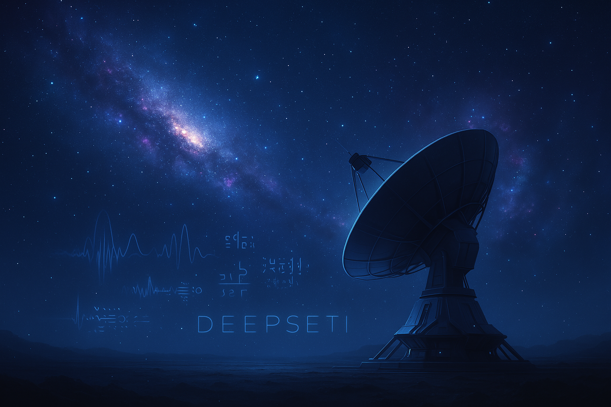

# 🌌 DeepSETI

DeepSETI, dünya dışı yaşam araştırmalarına derin öğrenme tekniklerini entegre eden bir projedir. 
Bu çalışma, radyo sinyallerini analiz ederek anomalileri tespit etmeyi ve potansiyel olarak dünya dışı kaynaklardan gelebilecek sinyalleri sınıflandırmayı amaçlamaktadır. 

---

## 📌 Projenin Amacı

SETI (Search for Extraterrestrial Intelligence) araştırmaları, genellikle radyo astronomi verilerinden anomali tespiti üzerine kuruludur. DeepSETI projesi, **derin öğrenme modelleri** kullanarak bu verileri analiz etmeyi ve olası anomalileri belirlemeyi hedefler. 

## 🧩 Kullanılan Yöntemler
- **Veri Kaynağı:** Open Berkeley'nin **Breakthrough Listen** veri setleri
- **Özellik Çıkarma:** FFT (Fourier Transform), Mel Spectrogram, Wavelet Dönüşümü
- **Derin Öğrenme Modelleri:** CNN, LSTM, Transformers
- **Değerlendirme Metrikleri:** Doğruluk, ROC-AUC, F1-Score, Precision-Recall

## 📸 Görseller

**Radyo Sinyali Analizi**

**Spektral Özellik Çıkarma**

**Evrenin Derinliklerinden Gelen Sinyaller**

**Carl Sagan**

**Dr.Ellie Arroway**

---

## 📜 Lisans
Bu proje MIT Lisansı altında sunulmuştur.

---

## 📬 İletişim
Sorularınız için: **nil.uzunoglu@std.yildiz.edu.tr** adresinden ulaşabilirsiniz.
